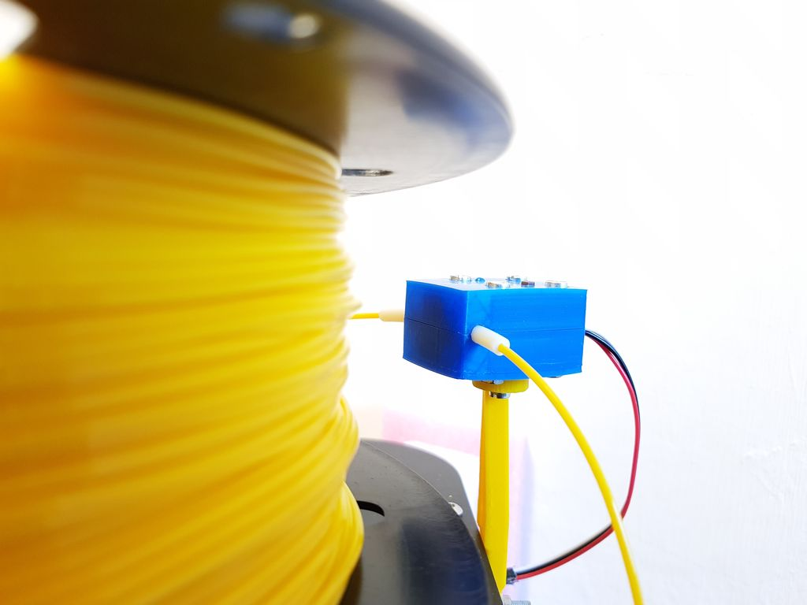
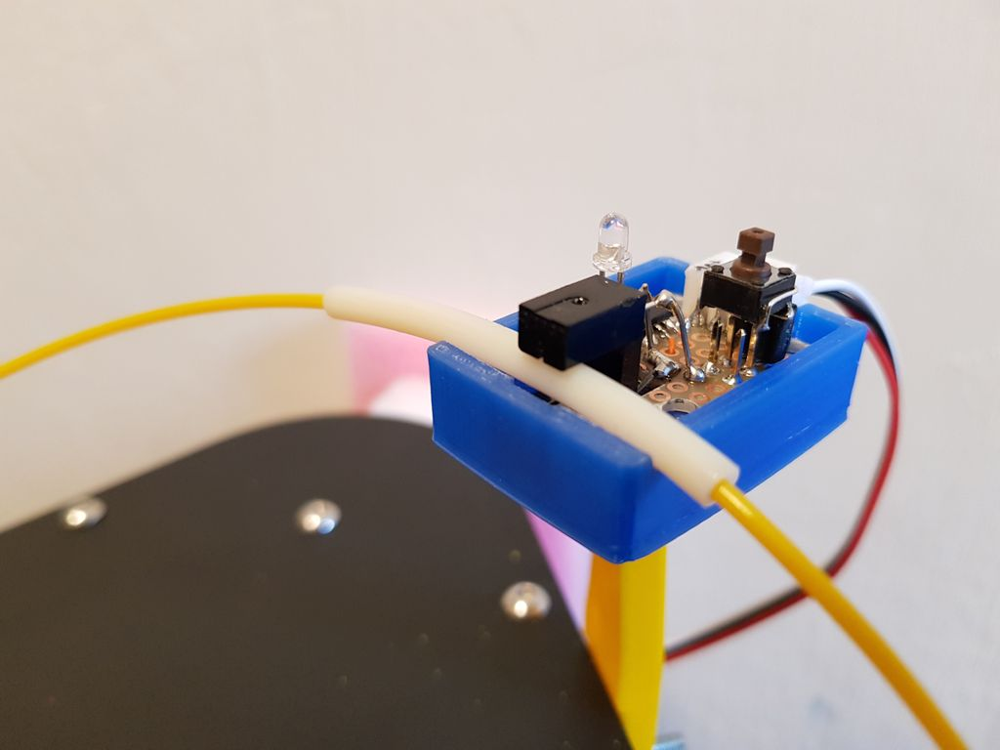
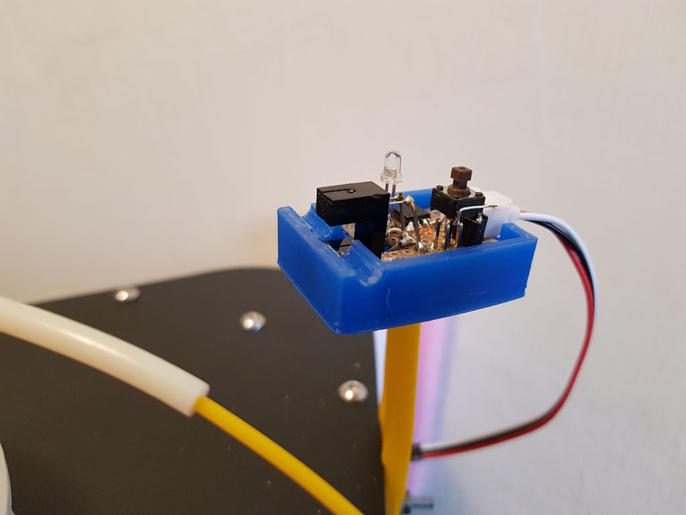
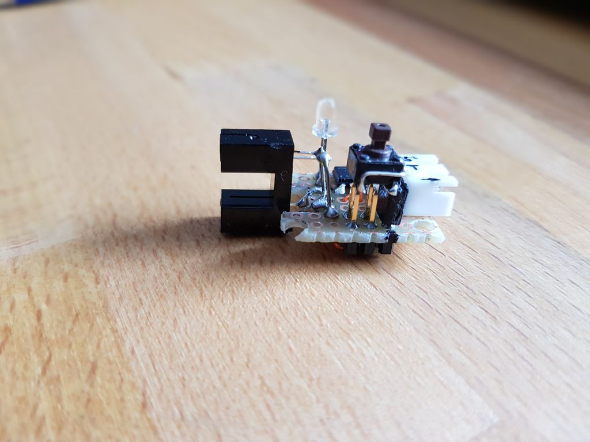
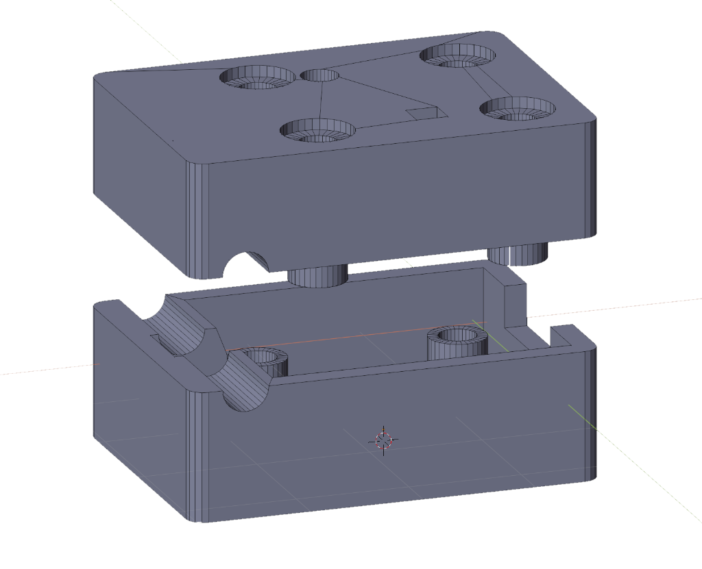
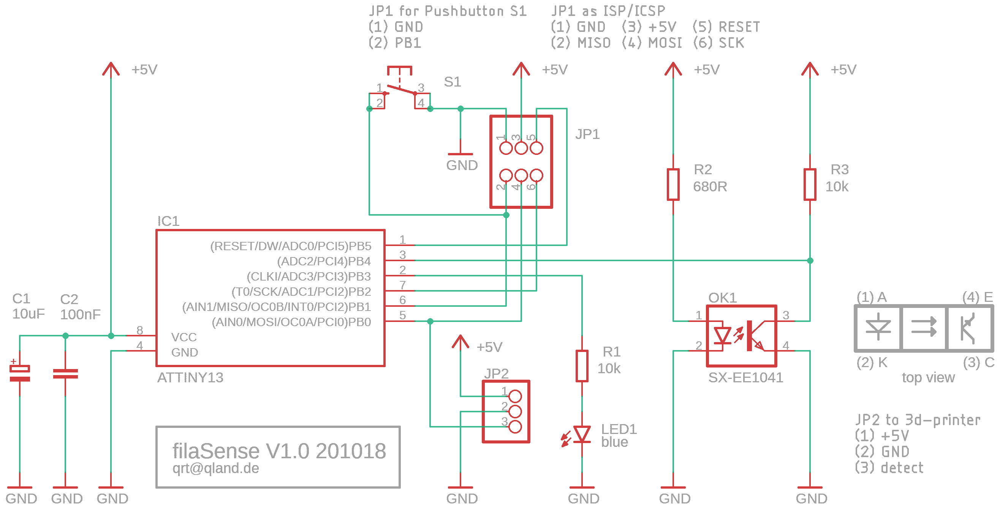

# **Optical Filament Runout Sensor**

Optical filament detection is not as easy as it seems at first glance. Especially transparent filaments might focus sensor-LED light and even enhance detection levels instead of dampen them as opaque filaments do. As a consequence this is a 'change of condition sensor' that detects well the runout of filament but not the presence or absence of it.

<br>

## Operation
The sensors state of operation is indicated by a LED. After a filament runout (or load) happens, the sensor reports it by a two second pulse to the 3d-printer and the LED starts long-blinking until the button is pressed.

### LED
- **constantly on**  
sensor online
- **short blink**  
sensor offline
- **long blink**  
filament runout (or load) detected

### Button
- **if sensor is online or offline**  
toggle online/offline
- **if a change was detected**  
make sensor online

### Source
- be sure to set ATTINY13 fuses as documented in source comments
- change the detection logic
```
.define     LOGIC       0               ;0 LOW or 1 HIGH means detection for 3d-printer
```
- dampen detection level by rising SLCY
```
.equ    SLSCY       =   22              ;t = SLSCY * ct * 256, slow service cycle                           
```

<br>

---

<br>

## Views

### ready mounted sensor

<br>
<br>

### the filament teflon tube has to be exactly in the optical axis of the slotted optical sensor

<br>
<br>

### teflon tube removed

<br>
<br>

### hand wired prototype, the push-button is removable to allow in circuit programming of the ATTINY13 controller

<br>
<br>

### 3d-print files in stl format are in the repository

<br>
<br>

### schematic (a pcb layout does not exist (yet))


<br>
<br>

---

[qrt@qland.de](mailto:qrt@qland.de) 201017
